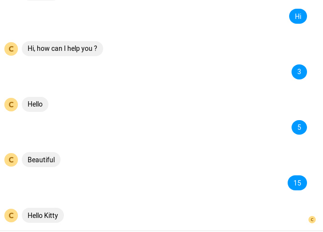

# FizzBuzz Chat bot

This project uses [messenger-platform-samples](https://github.com/fbsamples/messenger-platform-samples) as a starting point,
visit it for more information.

## What is it
A basic chat bot applies the legend FizzBuzz questions

## What will it do
The chat bot will reply the predefined text when the user send a message with predefined keyword

| Input | Message |
| ----- | ---- |
| Hi	                        | Hi, how can I help you ?
| [any number divided by 3]	    | Hello
| [any number divided by 5]	    | Beautiful
| [any number divided by 3 & 5]	| Hello Kitty

<details> 
<summary><b>Result image</b></summary>

</details>

## Usage
You can host this on heroku (or other host) easily with heroku command
```
heroku builds:create -a  YOUR_HEROKU_APP
```

Then add `PAGE_ACCESS_TOKEN` and `VERIFY_TOKEN` enviroment variables and you are done.

*Note: You can add `PAGE_PSID` to avoid the app logs page response when the user send a message*

## License
Same license as [messenger-platform-samples](https://github.com/fbsamples/messenger-platform-samples)
